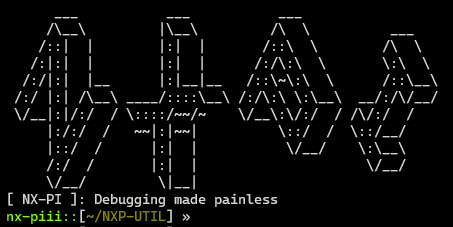
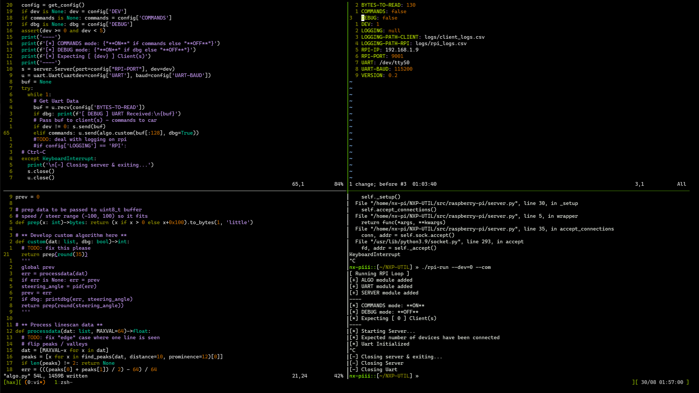

# [ NXP CUP Util ]

**Debugging the NXP Cup Car, and visualizing data.**

**Avoid fiddling with embedded code and have `Python3` aid you in your algorithm development.**

**The Trifecta**:


**Stay away from the painful experience the MCUXpresso IDE provides:**





## **TL;DR: Setup**
Install required `Python3` packages:

```
pip install -r requirements.txt
```

Set up your configuration by editing `config/config.yaml`.

**Raspberry-PI:**

```
./rpi-run
```

for setting the some config options on-the-fly, check out
```
./rpi-run -h
```

**Client(s):**

```
.\CarDbgGUI.exe
```
or run the `Python3` script
```
python3 CarDbgGUI.py
```

## **Basic Idea**

### Generic Debugging

* Car --> Raspberry-PI: `UART` Connection
* Raspberry-PI --> Client(s): `WIFI` Connection

Transmit your car's **crucial data**, such as:
  * LineScan Camera Output
  * Steering Angle and
  * Vehicle Speed

over to your machine for viewing and proccessing, all in `real-time`.

### Development

Use the `Commands` Mode and let your `Raspberry-PI` take the wheel!

Experiment and develop your algorithm in `Python3` for quick prototyping.
Test it out, and ***then*** write it in `C`!

## **Building**

If modifications are needed, you can rebuild your `.exe` / `binary` executable with pyinstaller:

```
pyinstaller --onefile --nowindowed --icon="assets/rpi.ico" --distpath="bin/" --name="CarDbgGUI.exe" src/client/CarDbgGUI.py
```

## **The Raspberry-PI**

The Raspberry-PI allows `multiple clients` to view and visualize the transmitted data
simultaneously. Allow the whole team to take part!

Basic `dnsmasq` / `hostapd` setup for WIFI access.

**Optional**: Use `systemd` to run on startup.

## **Graphical User Interface**

Makes a connection to the server.

Visualizes LineScan output in real-time with `Matplotlib Graphing`.

**Steering Angle** and **Vehicle Speed** also available for viewing.

## **COMMANDS mode:**

Let the `Raspberry-PI` use the LineScan's output to **generate a new trajectory** for your vehicle.

Develop your algorithm in `Python3` before writting large amounts of C code.

Runs `server-side` for "speed". Not super fast, but very useful nontheless.

**[ ! ]** Make sure the car is running in `commands` mode too.

**Recommended (if not debugging):** 0 Clients

## **LOGGING mode:**

[TODO]: Logging option (None / "PI" / "CLIENT") to keep logs in selected device.
