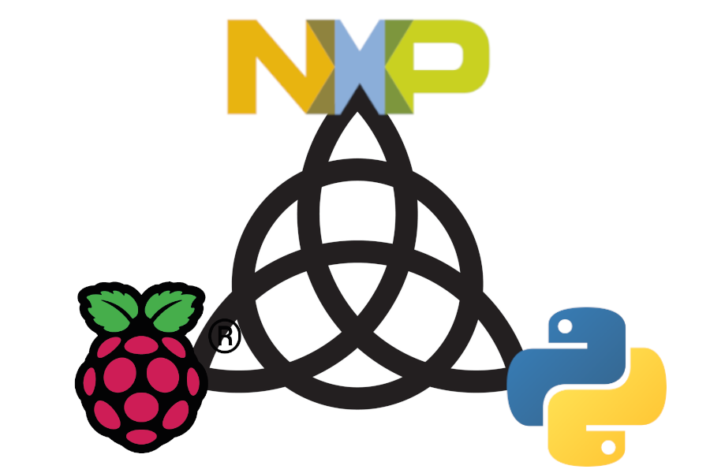

# NXP CUP Util

**Debugging the NXP Cup Car, and visualizing data**.
Avoid fiddling with embedded code and have `Python3` aid you in algorithm development.

**The Trifecta**:



## TL;DR
Raspberry-PI:

```
./rpi-run --dev=<NUMBER OF CLIENTS>
```

Client(s):

```
.\CarDbgGUI.exe
```
or run the `Python3` script
```
python3 CarDbgGUI.py
```

## Basic Idea

* Car to Raspberry-PI: `UART` Connection
* Raspberry-PI to Clients: `WIFI` Connection

Transmit your car's **crucial data**, such as:
  * Linescan Camera Output
  * Steering Angle and
  * Vehicle Speed

over to your machine for viewing and proccessing, all in `real-time`.

## Getting Started

Install required `Python3` packages:

```
pip install -r requirements.txt
```

Set up your configuration by editing `config/config.yaml`.

If modifications are needed, you can rebuild your `.exe` / `binary` executable:

```
<Insert pyinstaller command for building>
```

## The Raspberry-PI

The Raspberry-PI allows `multiple clients` to view and visualize the transmitted data
simultaneously.

Basic `dnsmasq` / `hostapd` setup for WIFI access.

Optional: Use systemd to run on startup

## Graphical User Interface

Makes the `ip:port` connection to the server.

Visualizing linescan output in real-time using `Matplotlib` graphing.

## (optional) COMMANDS mode:

[TODO]: Car can accept commands through UART to access underlying API.

Useful for testing algorithms in python3 instead of writing massive amounts of C code.

## (optional) LOGGING mode:

[TODO]: Logging option (None / "PI" / "CLIENT") to keep logs in selected device.